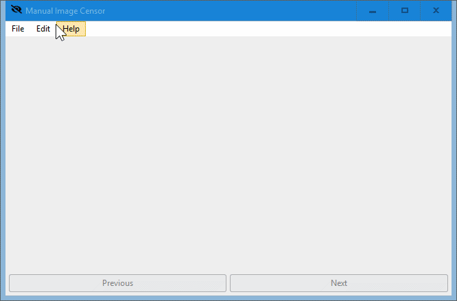

# Manual Image Censor

Tool to aid manually censoring parts of images, created at the request of [this](https://old.reddit.com/r/software/comments/k06117/looking_for_a_program_to_easily_draw_black_boxes/) Reddit thread.

## Preview

## Usage

1. Place the Sciter executable [scapp.exe](https://github.com/c-smile/sciter-sdk/tree/master/bin.win/x64) inside this folder.

2. Run `scapp.exe`.

3. Open the folder containing the images (must be `.jpg` format).

-  Click and drag to draw a black rectangle on the image.  
- - **The image (with changes) is overwritten upon advancing to another image.**

-  Use the mouse wheel to advance to the next (or previous) image.

## Todo

- [x] Resizable window
- [x] Support JPEG
- [ ] Zoom
- [x] Undo
- [ ] Arrow key navigation